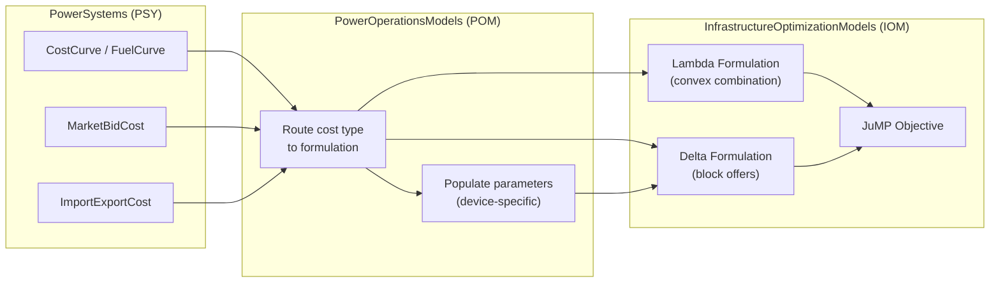
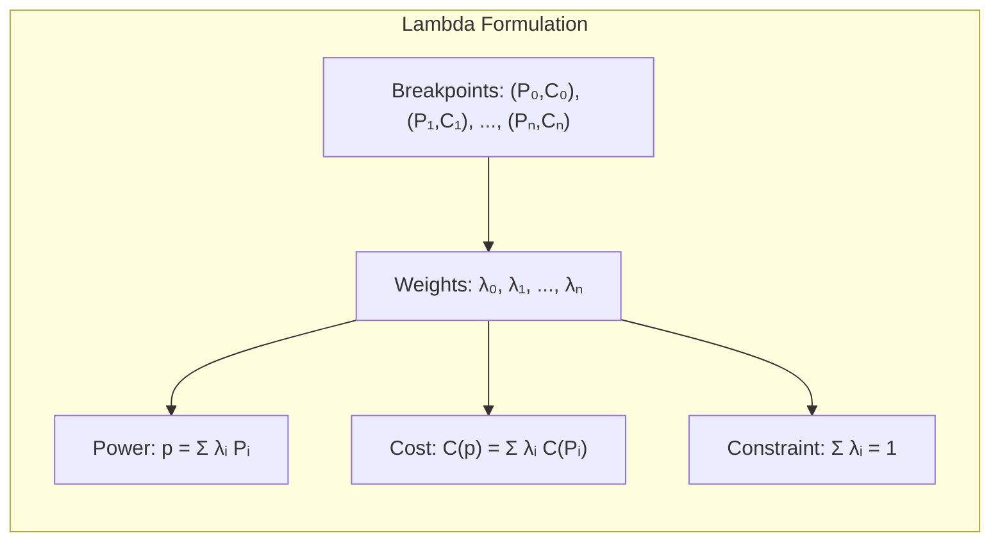
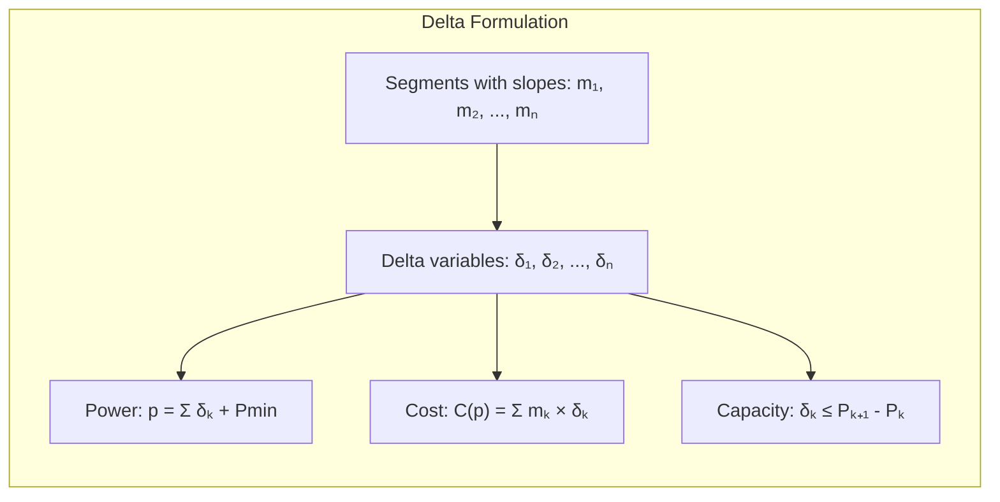
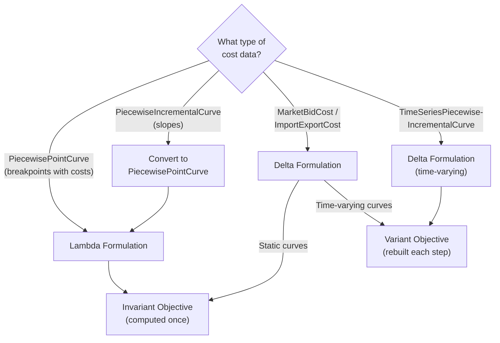
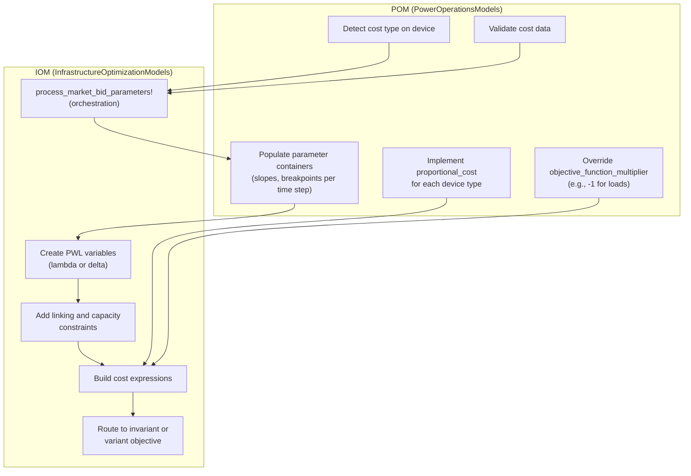

# Piecewise Linear Cost Functions

```@meta
CurrentModule = InfrastructureOptimizationModels
```

## What Is a Piecewise Linear Cost Function?

In power systems, the cost to produce electricity from a generator is rarely a straight
line. As you push a generator harder, the marginal cost of each additional MW often
changes. A **piecewise linear (PWL)** cost function approximates this curve by connecting
a series of straight-line segments between breakpoints.

For example, a generator might have the following cost structure:

| Power Output (MW) | Marginal Cost (\$/MWh) |
|:------------------:|:---------------------:|
| 50 (min)           | 20                    |
| 100                | 25                    |
| 150                | 35                    |
| 200 (max)          | 50                    |

This means the first 50 MW above minimum costs \$20/MWh, the next 50 MW costs \$25/MWh,
and so on. The total cost is the sum of the cost of each segment.

This package provides **two formulations** for encoding such curves into a JuMP
optimization model. Both express an operating point and its cost as a point on a piecewise
linear curve connecting breakpoints
``(P_0, C_0), (P_1, C_1), \ldots, (P_n, C_n)``, but they approach the problem differently.

## How IOM and POM Work Together

InfrastructureOptimizationModels (IOM) provides the **mathematical formulations** — the
variables, constraints, and expressions that encode a PWL curve into JuMP. It does not
decide which cost type applies to which device.

PowerOperationsModels (POM) provides the **device-specific routing** — it knows that a
`ThermalGen` with `MarketBidCost` should use the delta formulation, or that a
`RenewableDispatch` with `CostCurve{PiecewisePointCurve}` should use the lambda
formulation.



**In short:**
- **POM decides** which formulation to use for each device and cost type.
- **IOM builds** the JuMP variables, constraints, and objective expressions.
- Cost data comes from **PSY** (PowerSystems.jl) components.

## Lambda Formulation (Convex Combination)

Used by `CostCurve{PiecewisePointCurve}` and `FuelCurve{PiecewisePointCurve}`.

The lambda formulation assigns a weight ``\lambda_i`` to each **breakpoint**. The
operating point and cost are expressed as a weighted average of the breakpoint values.
Think of it as saying: "The generator is operating at a mix of these known cost points."

### Visual Intuition



### Formulation

Given ``n + 1`` breakpoints with power levels ``P_0, \ldots, P_n`` and costs
``C(P_0), \ldots, C(P_n)``:

**Variables:**

```math
\lambda_i \in [0, 1], \quad i = 0, 1, \ldots, n
```

**Constraints:**

```math
\begin{aligned}
p &= \sum_{i=0}^{n} \lambda_i \, P_i && \text{(linking)} \\
C(p) &= \sum_{i=0}^{n} \lambda_i \, C(P_i) && \text{(cost)} \\
\sum_{i=0}^{n} \lambda_i &= u && \text{(normalization, } u \text{ = on-status)} \\
\text{at most two adjacent } &\lambda_i \text{ may be nonzero} && \text{(adjacency)}
\end{aligned}
```

### Adjacency Enforcement

The adjacency condition keeps the operating point on a single line segment. For
**convex** cost curves (where each segment is more expensive than the last), the
optimizer naturally satisfies this condition — no extra constraints are needed.

For **non-convex** cost curves, an
[SOS2 constraint](https://en.wikipedia.org/wiki/Special_ordered_set) is added to
enforce adjacency explicitly. This requires solver support for SOS2, and effectively
introduces additional branching in the solver.

### Compact Form

When the power variable represents output above minimum generation
(PowerAboveMinimumVariable), a compact variant adjusts the linking constraint to
include a ``P_{\min}`` offset:

```math
\sum_{i=0}^{n} \lambda_i \, P_i = p + P_{\min} \cdot u
```

### Variables and Constraints

| Container Type                                       | Description                                  |
|:---------------------------------------------------- |:-------------------------------------------- |
| [`PiecewiseLinearCostVariable`](@ref)                | Lambda weights ``\lambda_i \in [0, 1]``      |
| [`PiecewiseLinearCostConstraint`](@ref)              | Links power variable to weighted breakpoints |
| [`PiecewiseLinearCostNormalizationConstraint`](@ref) | Ensures ``\sum \lambda_i = u``               |

### Public API

| Function                                                              | Role                                                           |
|:--------------------------------------------------------------------- |:-------------------------------------------------------------- |
| [`add_pwl_linking_constraint!`](@ref)                                 | Links power variable to weighted breakpoints                   |
| [`add_pwl_normalization_constraint!`](@ref)                           | Ensures ``\sum \lambda_i = u``                                 |
| [`add_pwl_sos2_constraint!`](@ref)                                    | Adds SOS2 adjacency for non-convex curves                      |
| [`add_variable_cost_to_objective!`](@ref)                             | Entry point — orchestrates variables, constraints, and cost    |

## Delta Formulation (Incremental / Block Offers)

Used by `MarketBidCost` and `ImportExportCost` offer curves.

The delta formulation assigns a variable ``\delta_k`` to each **segment**, representing
how much of that segment has been used. Think of it as filling buckets: fill the cheapest
bucket first, then the next cheapest, and so on.

### Visual Intuition



### Formulation

Given ``n`` segments with breakpoints ``P_0, \ldots, P_n`` and marginal costs (slopes)
``m_k = \frac{C(P_k) - C(P_{k-1})}{P_k - P_{k-1}}``:

**Variables:**

```math
\delta_k \geq 0, \quad k = 1, \ldots, n
```

**Constraints:**

```math
\begin{aligned}
p &= \sum_{k=1}^{n} \delta_k + P_{\min,\text{offset}} && \text{(linking)} \\
\delta_k &\leq P_k - P_{k-1} && \text{(segment capacity)} \\
C(p) &= \sum_{k=1}^{n} m_k \, \delta_k && \text{(cost)}
\end{aligned}
```

### Convexity Advantage

For convex offer curves (``m_1 \leq m_2 \leq \cdots \leq m_n``), the fill-order
condition is automatically satisfied. A cost-minimizing optimizer fills cheap segments
before expensive ones, so no SOS2 constraints or binary variables are needed. This is
the common case in power systems, where generator marginal costs are typically
increasing.

### Direction: Incremental vs Decremental

The delta formulation supports two directions:

- **Incremental (supply):** Represents power *produced*. The generator fills segments
  from low to high cost. Uses `PiecewiseLinearBlockIncrementalOffer` variables.
- **Decremental (demand):** Represents power *consumed*. The load fills segments from
  high to low willingness-to-pay. Uses `PiecewiseLinearBlockDecrementalOffer` variables.

POM determines which direction to use based on the device type and formulation.

### Variables and Constraints

| Container Type                                           | Description                            |
|:-------------------------------------------------------- |:-------------------------------------- |
| [`PiecewiseLinearBlockIncrementalOffer`](@ref)           | Delta variables for incremental offers |
| [`PiecewiseLinearBlockDecrementalOffer`](@ref)           | Delta variables for decremental offers |
| [`PiecewiseLinearBlockIncrementalOfferConstraint`](@ref) | Linking + capacity for incremental     |
| [`PiecewiseLinearBlockDecrementalOfferConstraint`](@ref) | Linking + capacity for decremental     |

### Public API

| Function                                                              | Role                                                     |
|:--------------------------------------------------------------------- |:-------------------------------------------------------- |
| [`add_pwl_variables!`](@ref)                                          | Creates ``n`` delta variables per time step              |
| [`add_pwl_term!`](@ref)                                               | Orchestrates variables, constraints, and cost expression |
| [`get_pwl_cost_expression`](@ref)                                     | Builds ``\sum m_k \, \delta_k`` cost expression          |
| [`add_pwl_block_offer_constraints!`](@ref)                            | Low-level block-offer constraint builder                 |
| [`add_variable_cost_to_objective!`](@ref)                             | Entry point for offer curve costs                        |

## Comparison

|                      | Lambda (``\lambda``)               | Delta (``\delta``)                  |
|:-------------------- |:---------------------------------- |:----------------------------------- |
| **Thinks about**     | Breakpoints (the dots)             | Segments (the lines)                |
| **Variables**        | ``n + 1`` (one per breakpoint)     | ``n`` (one per segment)             |
| **Output equation**  | ``p = \sum \lambda_i \, P_i``      | ``p = \sum \delta_k + P_{\min}``    |
| **Cost equation**    | ``C = \sum \lambda_i \, C(P_i)``   | ``C = \sum m_k \, \delta_k``        |
| **Adjacency rule**   | Must be enforced explicitly (SOS2) | Often automatic (convex case)       |
| **Binary variables** | Usually needed (non-convex)        | Often not needed (convex case)      |
| **Used by**          | `CostCurve`, `FuelCurve`           | `MarketBidCost`, `ImportExportCost` |

## When Does the Choice Matter?

For **convex** cost functions — where each segment costs more than the last — the delta
formulation is typically simpler and faster. The optimizer fills cheap segments first on
its own, so no extra adjacency constraints are needed. This is the common case in power
systems.

For **non-convex** cost functions — where a segment might be cheaper than the one before
it — both formulations need additional constraints (SOS2 or binary variables) to force
the correct ordering. In that case the lambda formulation is the traditional choice.

## Cost Type Routing

The following table summarizes which cost data types route to which PWL formulation:

| Cost Data Type                        | Formulation        | Notes                                      |
|:--------------------------------------|:-------------------|:-------------------------------------------|
| `CostCurve{PiecewisePointCurve}`      | Lambda             | Direct (x, y) breakpoints                  |
| `FuelCurve{PiecewisePointCurve}`      | Lambda             | Fuel consumption curve x fuel price         |
| `CostCurve{PiecewiseIncrementalCurve}`| Lambda (converted) | Converted to `PiecewisePointCurve` first   |
| `CostCurve{PiecewiseAverageCurve}`    | Lambda (converted) | Converted to `PiecewisePointCurve` first   |
| `MarketBidCost` (offer curves)        | Delta              | Slopes + breakpoints; supports time-varying |
| `ImportExportCost` (offer curves)     | Delta              | Import/export block offers                  |
| `CostCurve{TimeSeriesPiecewiseIncrementalCurve}` | Delta  | Time-series-backed; always time-varying     |



## The IOM-POM Boundary

The following diagram shows where IOM's responsibility ends and POM's begins:



**IOM provides:**
- Mathematical formulations (lambda, delta)
- PWL variable and constraint creation
- Objective expression building
- Parameter orchestration (`process_market_bid_parameters!`, `process_import_export_parameters!`)

**POM provides:**
- Device-specific cost routing (`add_variable_cost_to_objective!` overloads)
- Parameter population (`add_parameters!` implementations)
- Cost term extraction (`proportional_cost` implementations)
- Objective sign/multiplier overrides

## Incremental Interpolation (General PWL Approximation)

In addition to cost functions, the package provides a general-purpose incremental
(delta) method for approximating arbitrary nonlinear functions as piecewise linear. This
is used for PWL approximation of constraints (e.g., loss functions, quadratic terms).

### Formulation

Given breakpoints ``(x_1, y_1), \ldots, (x_{n+1}, y_{n+1})`` where ``y_i = f(x_i)``,
and interpolation variables ``\delta_i \in [0, 1]`` with binary ordering variables
``z_i \in \{0, 1\}``:

```math
\begin{aligned}
x &= x_1 + \sum_{i=1}^{n} \delta_i \, (x_{i+1} - x_i) \\
y &= y_1 + \sum_{i=1}^{n} \delta_i \, (y_{i+1} - y_i) \\
z_i &\geq \delta_{i+1}, \quad z_i \leq \delta_i \quad \text{(ordering)}
\end{aligned}
```

The ordering constraints ensure segments are filled sequentially: ``\delta_1`` must be
filled before ``\delta_2`` can begin.

### Public API

| Function                                                              | Role                                        |
|:--------------------------------------------------------------------- |:------------------------------------------- |
| [`add_sparse_pwl_interpolation_variables!`](@ref)                     | Creates ``\delta`` and ``z`` variables      |
